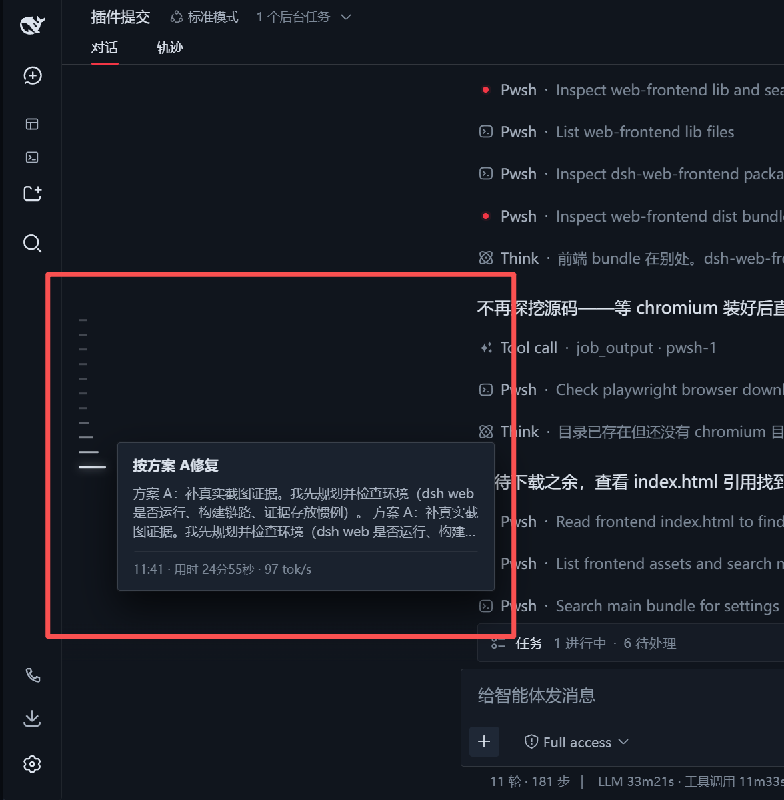

# DSH History Tree · Codex-style Conversation Timeline

[中文](README.md) | English

[](https://www.npmjs.com/package/dsh-history-tree)
[](https://www.npmjs.com/package/dsh-history-tree)



**DSH History Tree** is a DeepSeek Harness (DSH) Web UI plugin that adds a Codex-style conversation turn timeline rail and hover history overview cards to the left edge of chat messages.

## Features

- **Fixed vertically centered timeline rail**
  - Stays glued to the left edge of the workspace / sidebar divider, vertically centered in the viewport, and does not scroll with messages.
  - Generates one dash per real user question, ignoring deliverables, tool executions, and system placeholders.
  - Supports a max-height constraint (`max-height`) and smooth internal wheel scrolling for long conversations.
- **Fish-eye magnification**
  - Smooth step-wave magnification on hover: `26px / 19px / 14px / 10px / 8px`.
- **Hover overview card**
  - Line 1: the user's exact question text, with no redundant timestamps.
  - Line 2: the model's final reply / explanation text, strictly filtered to exclude Think, Bash tool execution, and file deliverables.
  - Footer: sent time · duration · token / throughput.
  - Click any dash or hover card to smoothly jump to that conversation turn.
- **Auto load older history**
  - Hovering over the top dash or scrolling to the top automatically triggers "load older" history and extends the timeline upward.

## Installation

DSH uses the Cordis modular microkernel architecture. You can install the plugin in either of the following ways.

### Option 1: Install from npm (recommended)

#### 1. Use the DSH CLI

```bash
dsh plugin --profile web add -w dsh-history-tree
```

#### 2. Or install it in the web profile directory

```bash
cd ~/.dsh/profiles/web
npm i dsh-history-tree
# or with pnpm
pnpm add -w dsh-history-tree
```

After installation, make sure `~/.dsh/profiles/web/package.json` contains `dsh-history-tree` in its `dsh.profile.bundles` array:

```json
{
  "name": "dsh-profile-web",
  "private": true,
  "dependencies": {
    "dsh-history-tree": "^1.0.0"
  },
  "dsh": {
    "profile": {
      "bundles": [
        "@deepseek-ai/dsh-base",
        "@deepseek-ai/dsh-web-app",
        "dsh-history-tree"
      ]
    }
  }
}
```

### Option 2: Install from a local source directory (link)

```bash
dsh plugin --profile web add -w "link:/path/to/dsh/plugin/dsh-history-tree"
```

> If startup reports duplicate sub-package declarations after `add`, check the `dsh.profile.bundles` array in `~/.dsh/profiles/web/package.json` to ensure it only contains root packages (such as `dsh-history-tree`, `@linxin666/dsh-web-ui-all`, etc.).

## Usage

Start the DSH web service:

```bash
dsh --profile web
# or
dsh web
```

Open [http://127.0.0.1:3080/](http://127.0.0.1:3080/), open any conversation with multiple turns, and you will see the vertically centered timeline rail on the left.

## Project Structure

```text
dsh-history-tree/
├── cordis.patch.yml   # Cordis plugin profile declaration patch
├── package.json       # Package manifest and client inject dependencies
├── README.md          # Chinese documentation
├── README.en.md       # English documentation
├── docs/
│   └── images/        # Screenshots and preview images
└── lib/
    ├── index.js       # Host (server-side) entry
    └── client.js      # Client (front-end fish-eye animation, DOM extraction, card rendering)
```

## License

MIT
